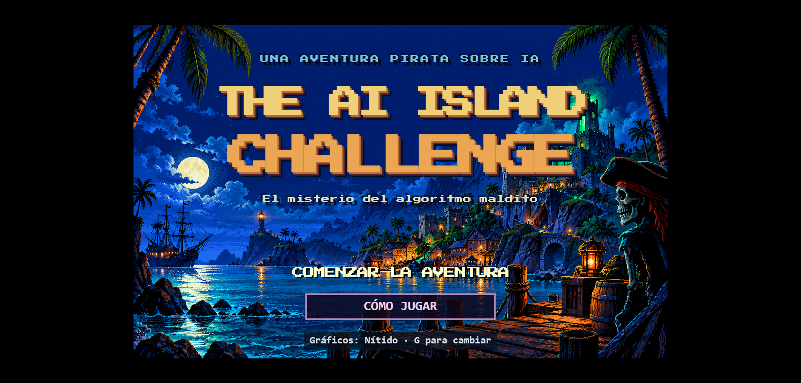

# The AI Island Challenge 🏴‍☠️




**v2.0 — Remasterización gráfica, nuevo guion y diálogos seleccionables**

Este repositorio contiene el **minijuego de aventura gráfica interactiva** que he desarrollado para divulgar el **Reglamento Europeo de Inteligencia Artificial (RIA)** mediante casos ficticios, puzles y humor pirata.

El **Capitán Mortaja** ha confiscado tus papeles del barco. Para recuperarlos tendrás que atravesar cuatro salas de su fortaleza y descubrir qué falla en sus sistemas de IA. Hasta estar vivo puede perjudicar tu candidatura.

> **Nota:** Este proyecto explora la creación de recursos educativos y de concienciación legal mediante desarrollo asistido por Inteligencia Artificial (Vibe Coding). No certifica sistemas reales ni concede potestad sancionadora.

## 📌 Características principales

* **Interfaz de aventura gráfica clásica:** Inspirada en *Monkey Island 2*, con nueve verbos, línea de acción e inventario. Utiliza un motor propio en JavaScript, no el intérprete SCUMM original.
* **Remasterización gráfica:** Cuatro escenarios, personajes y objetos ilustrados, con un avatar inspirado en el autor. Modo **Nítido por defecto** y alternativa **Clásico VGA**.
* **Nuevo guion y puzles:** Una misión conecta los cuatro casos: transparencia, selección de personal, límites de un filtro y prácticas prohibidas. Cada solución exige explorar, conversar y comprobar sus consecuencias; las obligaciones jurídicas pueden solaparse.
* **Conversaciones seleccionables:** Las respuestas esperan siempre una elección expresa. Lectura automática o al ritmo del jugador, pistas graduales y personajes en reposo durante el habla. El protagonista conserva una caminata básica con arranque y frenada suaves.
* **Desenlace propio:** Encuentro con el Capitán Mortaja, recuperación de los papeles del barco y repaso educativo. El reconocimiento final acredita participación en el juego.
* **Totalmente autocontenido:** Imágenes PNG, fuente, estilos y JavaScript incrustados en un **único archivo HTML**, sin dependencias externas para jugar y con funcionamiento sin conexión.
* **Experiencia inmersiva y accesible:**
    * Ayuda visible desde portada, con botones para volver, iniciar o continuar la partida.
    * Controles mediante ratón, teclado y toque; opciones de lectura y movimiento reducido.
* **Contenido jurídico revisado:** Cuaderno con referencias al RIA y las guías de la **AESIA**. Distingue proveedor, responsable del despliegue y autoridad; explica que una revisión registrada no certifica conformidad y un sello no concede poderes públicos.

## 🗺️ Hoja de ruta

| Estado | Versión | Descripción |
| :---: | :--- | :--- |
| ✅ | **v1.0 — Prototipo original** | Interfaz de aventura gráfica con formas CSS/SVG y casos educativos autocontenidos en un HTML. |
| 🔜 | **v1.0 → v2.0 — Evolución implementada** | Remasterización, modos Nítido y VGA, avatar personalizado, nuevo guion, puzles encadenados, diálogos seleccionables, cuaderno y final con el Capitán Mortaja. |

> 🎨 Los gráficos de la v2.0 son ilustraciones creadas para el proyecto, inspiradas en las aventuras gráficas de los 90. El Capitán Mortaja tiene nombre y diseño propios. No se utilizan fondos ni sprites extraídos de juegos comerciales ni existe afiliación con sus titulares.

## 🤖 Desarrollo asistido por IA (Vibe Coding)

Este proyecto es un caso práctico de **AI-Driven Development**, dirigido por el autor desde la conceptualización hasta la revisión de jugabilidad:

1. **Ideación y prototipado:** Diseño de la interfaz, arquitectura en Vanilla JavaScript y puzles educativos.
2. **Remasterización e integración:** Preparación de fondos, personajes, inventario y avatar; incrustación de recursos en el HTML autónomo y adaptación de ambos modos gráficos.
3. **Guion y precisión jurídica:** Revisión de diálogos y cuaderno para hacer comprensibles las causas y consecuencias de cada puzle, conservando el humor y las condiciones de las obligaciones legales.
4. **Depuración de mecánicas:** Revisión de inventario, opciones de conversación, lectura, pausa, movimiento y progreso. La última corrección muestra el sello al abrir la caja y permite recogerlo para avanzar.

La comprobación automatizada actual incluye **26 grupos de pruebas**, con exploración de **43 estados de progreso y 2.627 acciones**. Usa un adaptador DOM y reloj virtual: no sustituye una revisión visual en navegador ni pruebas en dispositivos táctiles físicos.

## 🛠️ Stack tecnológico

* **Core:** Vanilla JavaScript (ES6+), HTML5.
* **Estilado y movimiento:** CSS3 puro (Flexbox, CSS Grid, Keyframes) y desplazamiento con `requestAnimationFrame`.
* **Gráficos:** Ilustraciones PNG y atlas de poses incrustados, en versiones Nítido y VGA.
* **Distribución:** Un único HTML sin instalación de dependencias de ejecución.

## 💻 Instalación y uso local

🎮 [**Jugar online directamente en el navegador**](https://islandchallengeai.vercel.app/)

Para ejecutar este proyecto en tu entorno local:

1. Clona el repositorio:

   ```bash
   git clone https://github.com/ariaslombardero/The-AI-island-challenge.git
   ```

2. Navega al directorio del proyecto:

   ```bash
   cd The-AI-island-challenge
   ```

3. Abre `index.html` en un navegador moderno. No requiere dependencias ni servidor local. Los enlaces externos del cuaderno necesitan conexión.

| Control | Acción |
| :--- | :--- |
| Clic o toque sobre el suelo | Caminar |
| Verbo → elemento | Interactuar |
| Usar → objeto de inventario → destino | Combinar objetos |
| Opciones del panel inferior | Elegir una respuesta |
| Clic, Enter o Espacio durante un texto | Adelantar la lectura |
| G | Alternar Nítido y Clásico VGA |
| Cómo jugar o F1 | Abrir ayuda y cuaderno |
| F5, clic derecho o pulsación larga | Abrir el menú |
| Escape | Cerrar ayuda o menú |
| Tab y Enter/Espacio | Recorrer y activar controles |

Reiniciar o recargar comienza una partida nueva. No hay voces ni guardado de partida. Las correcciones locales requieren actualizar el despliegue para estar disponibles en la versión online.

## 📜 Licencia

El código está bajo la Licencia **MIT**. Consulta el archivo [LICENSE](./LICENSE) incluido en el repositorio. La fuente Press Start 2P conserva su licencia **SIL OFL 1.1**.

## 👨‍💻 Autor

**Jose Antonio Arias Lombardero**
*Experto en Inteligencia Artificial aplicada al sector público, innovación, contratación y fondos europeos.*

Esta aplicación forma parte de un portfolio de soluciones tecnológicas conceptualizadas, desarrolladas y desplegadas en entornos cloud para su aplicación en el sector público. Mi objetivo es demostrar cómo el uso estratégico de modelos avanzados de IA (Vibe Coding) puede contribuir a la digitalización, la operatividad y la alfabetización tecnológica de la Administración.

🔗 [Consulta mi portfolio completo de aplicaciones y trayectoria profesional](https://ariaslombardero.es/)
